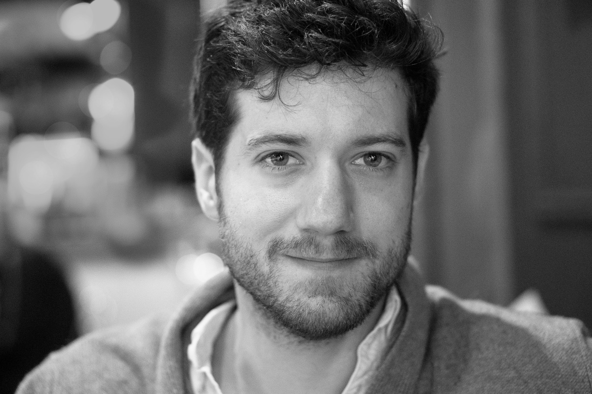

|-|-|
[Research](research.md) | [Publications](publications.md) | [Software](software.md)| [Contact](contact.md) | [CV](gabriele_albertini_vitae.pdf){:target="_blank"} |
|-|-|
| | |
|-|-|

I work on fracture of materials and friction/earthquakes. 
I mainly use numerical modeling of solids, high-performance computing and theoretical models. 
I also have experience on experimental fracture mechanics and Digital Image Correlation.

I am a fourth year PhD candidate at Cornell University and visiting researcher at ETH Zurich. 
I am lucky to be advised by [David Kammer](https://ifb.ethz.ch/compmech/people/prof-dr-david-kammer.html){:target="_blank"} and my dissertation is on *dynamic fracture of heterogeneous materials*. 

I used numerical and theoretical models to uncover the *physical mechanisms governing friction* in a collaboration with [Jay Fineberg](http://old.phys.huji.ac.il/~jay/){:target="_blank"} and [Ilya Svetlizky](https://scholar.google.co.il/citations?user=44mVMhIAAAAJ&hl=en){:target="_blank"}, who performed the experimental work.

I worked on an experimental project on fracture of *multi-material 3D printed polymers* with [Laurent Ponson](http://www.laurentponson.com/){:target="_blank"} and [Mathias Lebihain](https://scholar.google.com/citations?user=ZUSWpmMAAAAJ&hl=en&oi=ao){:target="_blank"}.

I collaborated with [Ahmed Elbanna](http://publish.illinois.edu/mcslabuiuc/people/ahmed-ettaf-elbanna/){:target="_blank"} on the development of a new *hybrid numerical method* coupling Finite Elements and Boundary Elements.

Currently, I am using theoretical and numerical models to study the *stochastic properties of static friction* in collaboration with [Mircea Grigoriu](https://www.cee.cornell.edu/faculty-directory/mircea-dan-grigoriu){:target="_blank"}. 

I am planning to work with [Greg McLaskey](https://courses.cit.cornell.edu/mclaskey/people.html){:target="_blank"} and [Chun-Yu Ke](https://chunyuke.com/){:target="_blank"} and use theoretical and numerical models to uncover the friction law of laboratory scale earthquakes performed on a 3m granite fault.

<!--I am wondering if you might add some broader statements about your work and your professional goals. What is your larger project? What questions interest you? What are the broader impacts of your work? What broader conversations in the field does your work contribute to?

You might look at some bio statements and websites from others in your field to see how they answer these kinds of questions. 

-->
