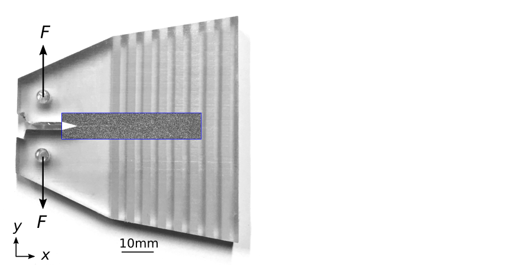

|-|-|
**Research**  | [Publications](publications.md) | [Software](software.md) | [Contact](contact.md) | [CV](gabriele_albertini_vitae.pdf){:target="_blank"} |
|-|-|
| | |
|-|-|

# Fracture #

## What happens when a crack gets trapped by an obstacle? ##

*Albertini, G.*, Lebihain, M., Hild, F. Ponson, L. and Kammer, D.S., 2020. 
[“Effective toughness of periodic heterogeneous materials: the role of rate-dependent fracture energy”](https://arxiv.org/abs/2003.13805){:target="_blank"}, 
**under review**.

# Friction #

## Nucleation of slip patches mediates the onset of frictional motion ##

*How does random local strength affect the static friction coefficient?*

*Albertini, G.*, Karrer, S., Grigoriu, M. D., Kammer, D. S., 2020. [“Stochastic Properties of Static Friction”](https://doi.org/10.1016/j.jmps.2020.104242){:target="_blank"}, **Journal of the Mechanics and Physics of Solids,** *in press*. 

## Friction is Fracture ##

*The onset of frictional motion is characterized by the propagation of slip fronts, which -- like cracks --  break the discrete contacts at the frictional interface allowing sliding to occur.
In this study, we combine friction experiments with fracture-mechanics simulations and theory to study long sought-after interface properties, such as local fracture energy and frictional peak strength.*

<!---->

Svetlizky, I.1, *Albertini, G.1*, Cohen, G., Kammer, D.S. and Fineberg, J., 2020. 
["Dynamic fields at the tip of sub-Rayleigh and supershear frictional rupture fronts"](https://doi.org/10.1016/j.jmps.2019.103826){:target="_blank"}, 
**Journal of the Mechanics and Physics of Solids** 137, 103826. \\
1Equally Contributed

## Earthquake modeling ##

Ma, X., Hajarolasvadi, S., *Albertini, G.*, Kammer, D.S., Elbanna, A.E., 2019. 
["A hybrid finite element-spectral boundary integral approach: Applications to dynamic rupture modeling in unbounded domains"](https://doi.org/10.1002/nag.2865){:target="_blank"},
**International Journal for Numerical and Analytical Methods in Geomechanics** 43, 1, 317-338. 

*Albertini, G.*, Kammer, D.S., 2017. 
[“Off-fault heterogeneities promote supershear transition of dynamic mode II cracks”](https://doi.org/10.1002/2017JB014301){:target="_blank"},
**Journal of Geophysical Research: Solid Earth** 122, 2017JB014301.

 

 

