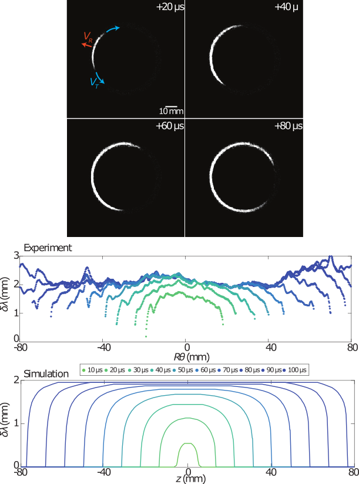
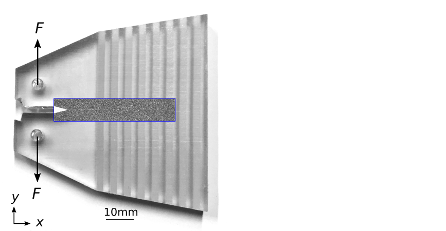

|-|-|
**Research**  | [Publications](publications.md) | [Software](software.md) | [Contact](contact.md) | [Open Positions](open_positions.md) |
|-|-|
| | |
|-|-|

# Friction #

## Pulse dynamics at soft-rigid interfaces: Why do basketball shoes squeak?

We show that **opening slip pulses** racing along the frictional interface are the underlying mechanism producing the squeaking sound. 
When the pulses are confined by **geometric patterning** of the sliding surface, they occur in an *ordered*, periodic manner, and the resulting squeak is clean, with a clear dominant frequency.
Conversely, in the absence of patterning, the pulses behave *chaotically*, giving rise to a scratch-like sound containing a broad distribution of frequencies.

<iframe width="560" height="315" src="https://www.youtube.com/embed/vwL1zUD1gyY" frameborder="0" allowfullscreen></iframe>

Djellouli, A.1, *Albertini, G*1., Wilt, J., Tournat, V., Weitz, D., Rubinstein, S. and Bertoldi, K., (2026), [“Squeaking at soft–rigid frictional interfaces”](https://doi.org/10.1038/s41586-026-10132-3), **Nature**.
1Equally Contributed

You can also read about our work on [phys.org](https://phys.org/news/2026-02-physics-sneaker-high-imaging-supersonic.html), [Science News](https://www.sciencenews.org/article/basketball-sneakers-squeak-physics), or in [The Conversation](https://theconversation.com/can-we-design-sports-shoes-that-dont-squeak-heres-what-the-science-says-277518) and in this interview with [The Naked Scientists](https://www.thenakedscientists.com/articles/interviews/physics-squeaky-shoes).

## Nucleation of slip patches mediates the onset of frictional motion ##

*How does random local strength affect the static friction coefficient?*

*Albertini, G.*, Karrer, S., Grigoriu, M. D., Kammer, D. S., 2021. [“Stochastic Properties of Static Friction”](https://doi.org/10.1016/j.jmps.2020.104242){:target="_blank"}, **Journal of the Mechanics and Physics of Solids** 147, 104242. 

## Friction is Fracture ##

*The onset of frictional motion is characterised by the propagation of slip fronts, which -- like cracks --  break the discrete contacts at the frictional interface allowing sliding to occur.
In this study, we combine friction experiments with fracture-mechanics simulations and theory to study long sought-after interface properties, such as local fracture energy and frictional peak strength.*

<!---->

Svetlizky, I.1, *Albertini, G.1*, Cohen, G., Kammer, D.S. and Fineberg, J., 2020. 
["Dynamic fields at the tip of sub-Rayleigh and supershear frictional rupture fronts"](https://doi.org/10.1016/j.jmps.2019.103826){:target="_blank"}, 
**Journal of the Mechanics and Physics of Solids** 137, 103826. \\
1Equally Contributed

## Earthquake source mechanics ##

Ma, X., Hajarolasvadi, S., *Albertini, G.*, Kammer, D.S., Elbanna, A.E., 2019. 
["A hybrid finite element-spectral boundary integral approach: Applications to dynamic rupture modeling in unbounded domains"](https://doi.org/10.1002/nag.2865){:target="_blank"},
**International Journal for Numerical and Analytical Methods in Geomechanics** 43, 1, 317-338. 

*Albertini, G.*, Kammer, D.S., 2017. 
[“Off-fault heterogeneities promote supershear transition of dynamic mode II cracks”](https://doi.org/10.1002/2017JB014301){:target="_blank"},
**Journal of Geophysical Research: Solid Earth** 122, 2017JB014301.

 ---
 
# Fracture #

## Breaking fast and slow: How do crack propagate in 3D?

When cracks slowly move forward in a 3D brittle material, they do so because of accompanying dynamic cracks propagating perpendicular to the main direction of motion.

 Cochard, T., Svetlizky, I., *Albertini, G.,* Viesca, R., Rubinstein, S.,  Spaepen, F., Yuan, C., Denolle, M.,  Song, Y.Q., Xiao, L., Weitz, D., 2024. ["Propagation of extended fractures by local nucleation and rapid transverse expansion of crack-front distortion"](https://www.nature.com/articles/s41567-023-02365-0){:target="_blank"}
**Nature Physics**.

## What happens when a crack gets trapped by an obstacle of higher fracture energy? ##

The crack adapts instantaneously its propagation speeds. The speed jump amplitude is governed by the crack tip energy balance, as predicted by brittle fracture theory.

*Albertini, G.*, Lebihain, M., Hild, F. Ponson, L. and Kammer, D.S., 2021,
[“Effective toughness of  heterogeneous materials with rate-dependent fracture energy”](https://doi.org/10.1103/PhysRevLett.127.035501){:target="_blank"}, 
**Physical Review Letters** 127, 035501. 
[arXiv:2003.13805](https://arxiv.org/abs/2003.13805){:target="_blank"}
